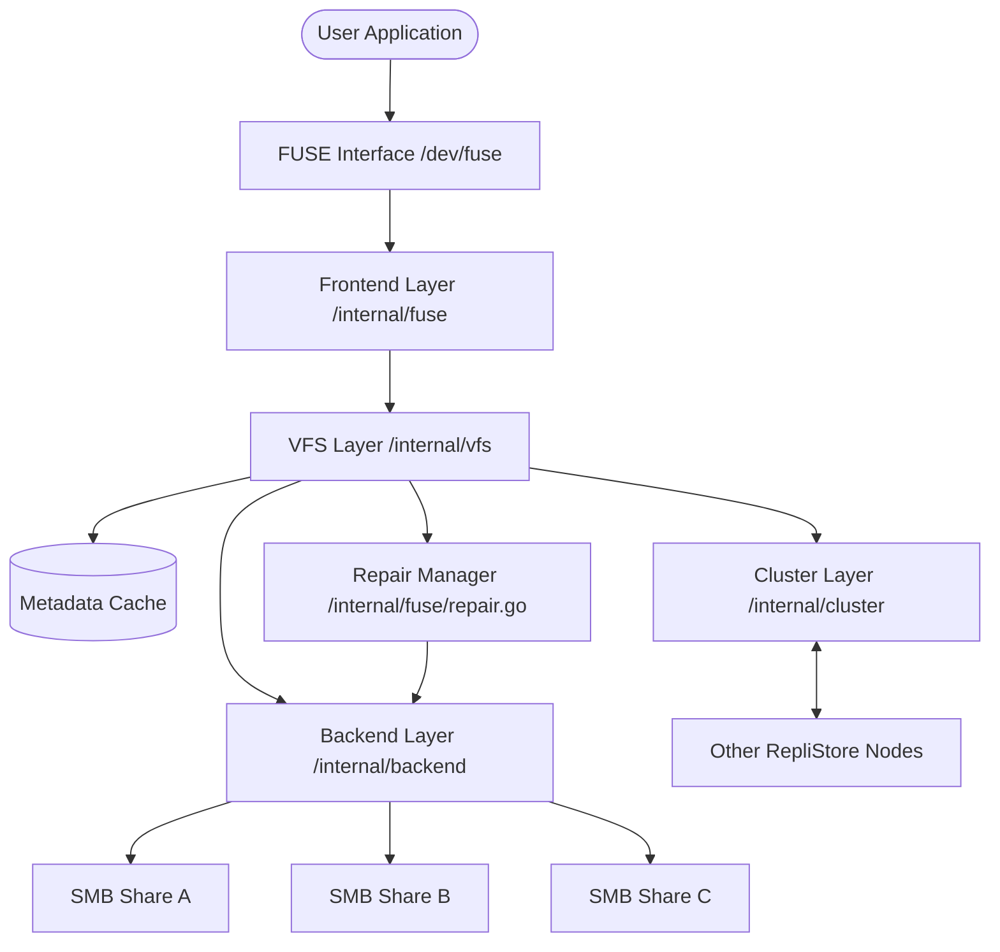

# RepliStore Architecture

RepliStore is a distributed, FUSE-based replicated storage system. It aggregates multiple SMB2/SMB3 network shares into a single unified mount point, providing file-level replication and high-performance metadata access.

## High-Level Overview

RepliStore consists of four primary layers:
1.  **Frontend (FUSE):** Translates OS syscalls into VFS operations.
2.  **Virtual File System (VFS):** Manages the unified namespace, replication logic, and metadata cache.
3.  **Cluster (P2P):** Handles node discovery and distributed locking across multiple RepliStore instances.
4.  **Backend (SMB):** Handles raw I/O and connectivity to the storage providers.

## Key Components

### Frontend Layer
Responsible for handling FUSE requests and converting them into VFS operations. It uses `bazil.org/fuse` as the FUSE library.

### VFS Layer
The core of the system. It maintains an in-memory tree structure (Metadata Cache) of the unified filesystem. It also implements the replication logic (selecting backends for writes) and read failover.

### Cluster Layer (DLM)
The Distributed Lock Manager (DLM) ensures that only one node in the cluster can perform conflicting operations (like writing to the same file) at any given time.
- **Discovery:** Uses Multicast DNS (mDNS) to automatically find other RepliStore nodes on the local network.
- **Consensus:** Implements a masterless quorum-based mutual exclusion algorithm.
- **Robustness:** Uses Lamport logical clocks for request ordering and TTL-based leases for automatic lock recovery after node failures.

### Backend Layer
Manages connections to remote SMB shares. It uses `github.com/hirochachacha/go-smb2` for SMB2/3 communication. It also includes a health monitor that periodically pings backends to check their availability.

### Repair Manager
A background worker that periodically scans the Metadata Cache for degraded files (those with fewer than `replication_factor` replicas) and attempts to restore them by copying data from healthy replicas to available backends.

## Design Philosophy

- **Authoritative Source:** Remote SMB shares are the ultimate source of truth.
- **In-Memory Metadata:** For high performance, directory listings and lookups are served from an in-memory cache populated during startup.
- **Statelessness:** No local database is required; the system reconstructs its state from the backends.
- **Quorum-Based Write Consistency:** Writes and creates are fanned out to all mapped backends and succeed if a configurable `write_quorum` acknowledges the operation. This provides a balance between reliability and availability.
- **I/O Resilience:** All backend and cluster RPC operations support `context.Context` for timeouts and cancellation, preventing kernel-level hangs in the FUSE filesystem.
- **Standardized Concurrency:** Parallel operations (writes, repairs, background sync) are managed using `golang.org/x/sync/errgroup` to ensure robust error collection and resource management.
- **Read Resilience:** Reads can fail over to alternative replicas if the primary choice is unavailable.
