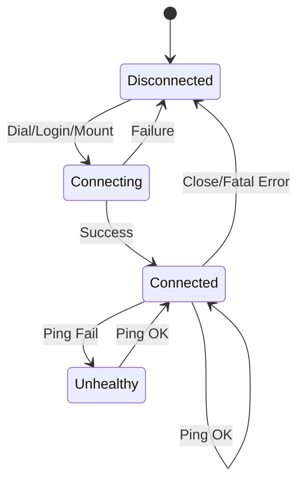

# SMB Backend Component

The backend layer handles the communication with remote SMB/CIFS storage servers.

## `Backend` Interface
This interface abstracts the storage operations and supports `context.Context` for all blocking calls:
- `Ping(ctx)`: Checks if the backend is alive.
- `ReadDir(ctx, path)`: Lists directory contents.
- `Stat(ctx, path)`: Gets file information.
- `Walk(ctx, path, fn)`: Recursively traverses a directory tree.
- `OpenFile(ctx, path, flag, perm)`: Opens a file for reading or writing.
- `Mkdir(ctx, path, perm)`: Creates a directory.
- `Remove(ctx, path)`: Deletes a file or directory.
- `Rename(ctx, old, new)`: Renames a file or directory.

## `File` Interface
The file handle interface also supports context-aware I/O:
- `ReadAt(ctx, b, off)`: Reads data at a specific offset.
- `WriteAt(ctx, b, off)`: Writes data at a specific offset.
- `Sync(ctx)`: Flushes changes to the remote storage.
- `Close()`: Closes the file handle.

## `SMBBackend` Implementation
The `SMBBackend` uses `github.com/hirochachacha/go-smb2` to connect to SMB2/3 shares. It manages:
- **TCP Connection:** Persistent connection to the SMB server.
- **Session:** NTLM authentication and session management.
- **Share:** Mounting and unmounting specific shares.

## Health Monitoring
The `HealthMonitor` runs in a background goroutine and periodically pings each configured backend.
- It maintains a thread-safe map of healthy/unhealthy statuses.
- This status is used by the `BackendSelector` to avoid using dead backends.

