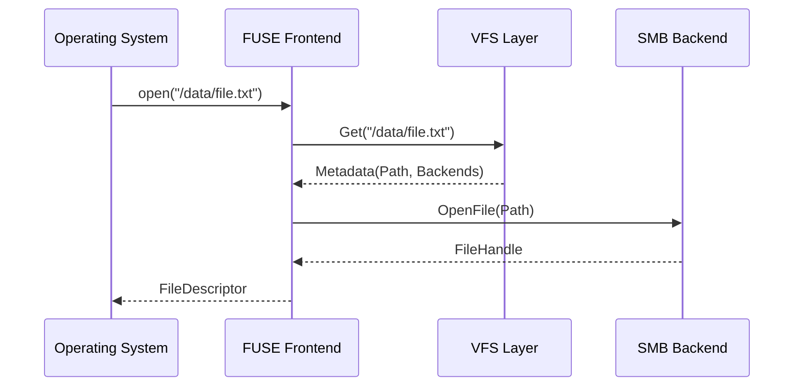

# FUSE Frontend Component

The FUSE frontend layer is responsible for translating kernel-level filesystem syscalls into RepliStore's internal VFS operations. It uses the `bazil.org/fuse` library.

## Key Types

### `RepliFS`
The root structure for the filesystem. It holds the `vfs.Cache`, the map of connected `backend.Backend` instances, and the `vfs.BackendSelector`.

### `Dir`
Implements `fs.Node` and `fs.HandleReadDirAller`. It represents a directory in the VFS.
- `Lookup`: Finds a child node by name in the metadata cache.
- `ReadDirAll`: Returns all directory entries from the metadata cache.
- `Create`: Creates a new file by selecting $RF$ backends and opening them.
- `Mkdir`: Creates a directory on all backends.
- `Remove`: Deletes a file or directory from all backends.

### `File`
Implements `fs.Node`. It represents a file in the VFS.
- `Attr`: Returns file attributes (size, mode, mtime) from the metadata cache.
- `Open`: Opens the file handles for reading or writing.

### `FileHandle`
Implements `fs.Handle`, `fs.HandleReader`, `fs.HandleWriter`, `fs.HandleFlusher`, and `fs.HandleFsyncer`.
- `Read`: Reads data from one of the replicas with automatic failover to others if an error occurs.
- `Write`: Writes data to all replicas in parallel.
- `Flush`: Called on `close()`. Triggers a synchronization of all open backend handles.
- `Fsync`: Explicitly synchronizes data to the backends.
- `Release`: Called when the handle is no longer needed. Closes all open handles on the backends.

## Concurrency Control
The FUSE layer uses the `vfs.Node.Mu` (a `sync.RWMutex`) to protect metadata. For I/O operations (network calls to backends), it carefully releases locks to prevent blocking the entire filesystem while waiting for network responses.

