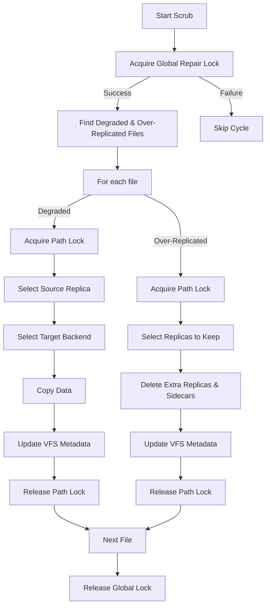

# Background Repair Manager Component

The Repair Manager is responsible for ensuring data durability by maintaining the desired replication factor ($RF$) for all files, which includes repairing degraded files (under-replication) and pruning extra replicas (over-replication).

## Overview

The `RepairManager` runs as a background process that periodically "scrubs" the filesystem to find and fix degraded files as well as prune over-replicated files. It uses a pool of worker goroutines managed by `golang.org/x/sync/errgroup` to perform repairs and pruning efficiently while respecting system-wide concurrency limits.

## Distributed Locking & Coordination

When RepliStore is running in a cluster, the Repair Manager coordinates with other nodes to ensure efficient and safe operations.

### Global Repair Lock
To avoid redundant NAS traffic, repair collisions, and pruning conflicts, the `RepairManager` attempts to acquire a **Global Repair Lock** (`.replistore/repair.lock`) at the start of every scrub cycle.
- Only one node in the cluster can hold this lock at a time.
- If a node fails to acquire the global lock, it silently skips the current repair cycle.
- This provides an implicit "leader election" for maintenance tasks.

### Path-Level Locking
Even when holding the global repair lock, the manager acquires a **Distributed Lock** for every individual file path before starting the repair or pruning operation.
- This ensures that repairs and pruning do not conflict with concurrent **Delete** or **Write** operations from other nodes.
- It prevents the "undelete" race condition.

## Workflow

1.  **Acquire Global Lock:** Attempt to lock `.replistore/repair.lock` via the cluster. If acquisition fails, the current scrub cycle is skipped.
2.  **Find Degraded and Over-Replicated Files:** The manager calls `vfs.Cache.FindDegraded(RF)` and `vfs.Cache.FindOverReplicated(RF)`.
3.  **For each degraded file (Repair):**
    - **Acquire Path Lock:** Acquire a distributed lock for the specific file path.
    - **Context Propagation:** Ensure all subsequent I/O operations (Select, Copy, Update) are tied to a `context.Context` to allow for graceful cancellation.
    - **Identify Source:** Select one healthy replica.
    - **Identify Targets:** Find healthy backends missing the replica.
    - **Perform Copy:** Stream the data from source to target.
    - **Update Metadata:** Register the new replica in the `vfs.Cache`.
    - **Release Path Lock.**
4.  **For each over-replicated file (Pruning):**
    - **Acquire Path Lock:** Acquire a distributed lock for the specific file path.
    - **Select Replicas to Keep:** Use the backend selector to choose the most-preferred $RF$ replicas.
    - **Prune Extra Replicas:** Delete data files and sidecars from the remaining (least-preferred) backends.
    - **Update Metadata:** Remove pruned backends from `vfs.Cache`.
    - **Release Path Lock.**
5.  **Release Global Lock.**

## Configuration

The Repair Manager is controlled by the following configuration parameters:
- `repair_interval`: How often the background scrub runs (e.g., `"1h"`).
- `repair_concurrency`: How many files can be repaired or pruned simultaneously (implemented via `errgroup.SetLimit`).

## Limitations

- **Directory Repair:** Currently, the Repair Manager focuses on files. Directories are expected to be created on all backends during the `Mkdir` operation.
- **Partial Metadata:** If a file is completely lost (0 replicas available in the cache), the Repair Manager cannot restore it.
- **Data Integrity:** The current implementation assumes replicas are identical if they have the same size and modification time. It does not perform checksum-based verification.

