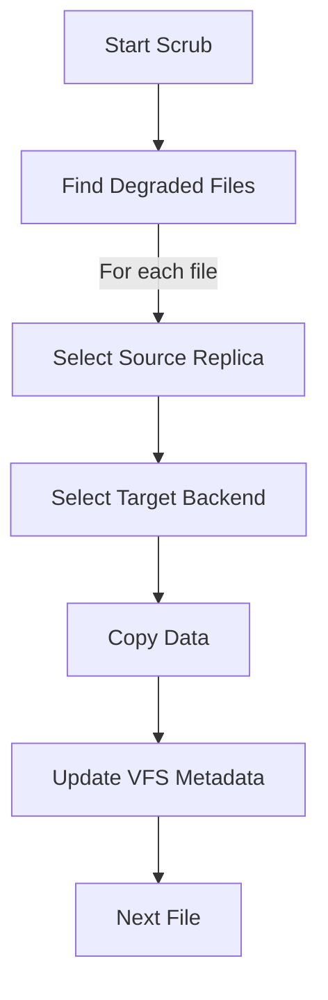

# Background Repair Manager Component

The Repair Manager is responsible for ensuring data durability by maintaining the desired replication factor ($RF$) for all files.

## Overview

The `RepairManager` runs as a background process that periodically "scrubs" the filesystem to find and fix degraded files.

## Workflow

1.  **Find Degraded Files:** The manager calls `vfs.Cache.FindDegraded(RF)`. This returns a list of all non-directory nodes that have fewer than $RF$ backends in their metadata.
2.  **Identify Source:** For each degraded file, it selects one of the existing healthy replicas to act as the source.
3.  **Identify Targets:** It uses the `vfs.BackendSelector` to find healthy backends that do **not** currently have a replica of the file.
4.  **Perform Copy:**
    - It opens the source file for reading.
    - It creates the destination file(s) on the target backend(s).
    - It streams the data from source to target.
5.  **Update Metadata:** Once the copy is successful, the target backend is added to the file's `Backends` list in the `vfs.Cache`.

## Configuration

The Repair Manager is controlled by the following configuration parameters:
- `repair_interval`: How often the background scrub runs (e.g., `"1h"`).
- `repair_concurrency`: How many files can be repaired simultaneously.

## Limitations

- **Directory Repair:** Currently, the Repair Manager focuses on files. Directories are expected to be created on all backends during the `Mkdir` operation.
- **Partial Metadata:** If a file is completely lost (0 replicas available in the cache), the Repair Manager cannot restore it.
- **Data Integrity:** The current implementation assumes replicas are identical if they have the same size and modification time. It does not perform checksum-based verification.

