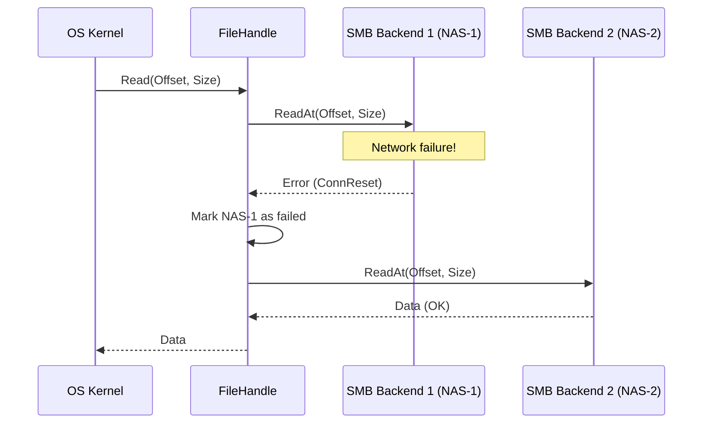

# Read Flow

The read flow in RepliStore is optimized for high availability and low latency.

## Process Overview

1.  **FUSE Request:** OS issues a `Read` request for a file.
2.  **Metadata Lookup:** The `vfs.Cache` provides a list of healthy backends that contain the file.
3.  **Backend Selection:** The `vfs.BackendSelector` picks one of the healthy backends.
4.  **Initial Attempt:** The request is sent to the selected backend.
5.  **Failover (Retry Loop):**
    - If the initial attempt fails (e.g., connection drop), RepliStore catches the error.
    - It marks the failed backend as "tried" for this specific handle.
    - It selects another healthy backend and retries the `Read` operation.
    - If all backends in the handle fail, it attempts to `Open` a new handle on another replica if one exists.
6.  **Data Return:** On success, the data is returned to the OS.

## Key Benefits
- **Zero Latency Metadata:** File location and size are known instantly from the cache.
- **High Availability:** A single backend failure does not interrupt active file reads.
- **Transparent Recovery:** The application is unaware of the underlying failover.
