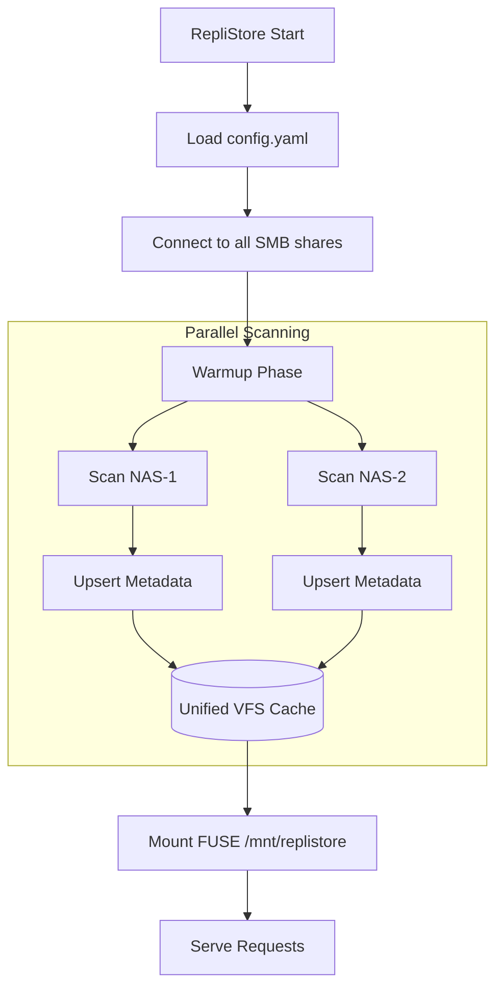

# Startup and Warmup Flow

When RepliStore starts, it goes through a "warmup" phase to build its internal metadata cache.

## Process Overview

1.  **Configuration Loading:** Loads the `config.yaml` file to get the list of backends and mount point.
2.  **Backend Connection:** Attempts to `Connect()` to all configured SMB shares.
3.  **Parallel Scan:**
    - For each connected backend, a `go-routine` is started to perform a recursive `Walk`.
    - This scan retrieves the names, sizes, modes, and modification times of all files and folders.
4.  **Cache Population:**
    - As each file is found, the `vfs.Cache.Upsert` method is called.
    - The cache builds a unified tree by merging entries from different backends.
    - If a file exists on multiple backends, it is recorded as a single entry with multiple backend locations.
5.  **FUSE Mounting:**
    - Once the initial scan of all backends completes, the FUSE filesystem is mounted at the specified `mount_point`.
6.  **Background Synchronization:**
    - After the initial warmup, a background synchronization loop starts (based on `cache_refresh_interval`).
    - It re-scans backends to reconcile the in-memory cache with any external changes, including additions, modifications, and deletions.
7.  **Serve Requests:**
    - The system begins serving user requests.

## Performance Considerations
- **Scanning Speed:** The speed of the warmup phase depends on the number of files and the network latency to the SMB shares.
- **Partial Results:** Currently, the system waits for all scans to complete before mounting. A planned improvement is to allow immediate mounting with "lazy loading" or "partial results" while the scan continues in the background.
