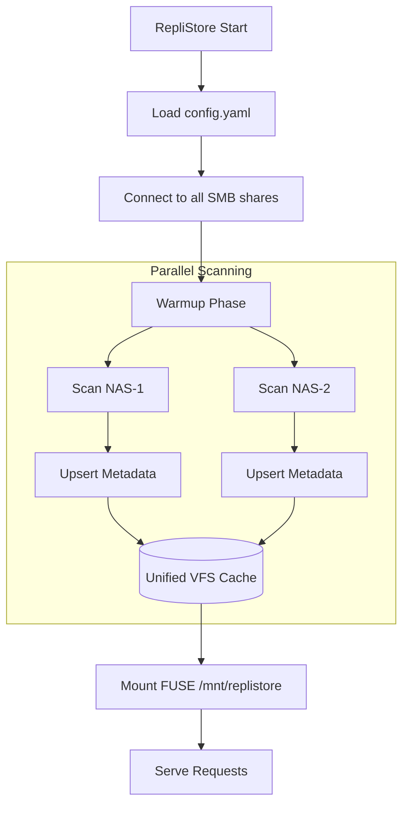

# Startup and Warmup Flow

When RepliStore starts, it goes through a "warmup" phase to build its internal metadata cache.

## Process Overview

1.  **Configuration Loading:** Loads the `config.yaml` file to get the list of backends, mount configuration (path and options), and state directory (`state_dir`).
2.  **Backend Connection:** Attempts to `Connect()` to all configured SMB shares.
3.  **Local Cache Loading:**
    - If a valid `cache.json` file exists in the configured `state_dir`, it is loaded directly into the in-memory `vfs.Cache` to enable immediate filesystem serving.
    - The `last_reconciled` timestamp is checked against `cache_refresh_interval`.
4.  **Parallel Scan / Warmup:**
    - If the loaded cache is relatively fresh (the time since `last_reconciled` is less than `cache_refresh_interval`), the initial background warmup scan is **skipped**.
    - If the cache is stale or does not exist, a background scan walk is started across all connected backends to validate and reconcile the cache.
    - Once the scan completes successfully, `last_reconciled` is updated to the current time, and the cache is saved back to `cache.json`.
5.  **FUSE Mounting:**
    - The FUSE filesystem is mounted immediately at the specified mount path (serving requests instantly using the loaded cache, or progressively as the scan populates it).
6.  **Background Sync and Periodic Saving:**
    - A background sync loop periodically runs based on `cache_refresh_interval` to reconcile cache with external changes, updating `last_reconciled` upon completion.
    - A background save loop periodically serializes the cache to `cache.json` every 30 seconds.
    - A signal handler ensures the cache is written to disk upon clean termination.
7.  **Serve Requests:**
    - The system begins serving user requests.

## Performance Considerations
- **Scanning Speed:** The speed of the warmup phase depends on the number of files and the network latency to the SMB shares.
- **Partial Results:** Currently, the system waits for all scans to complete before mounting. A planned improvement is to allow immediate mounting with "lazy loading" or "partial results" while the scan continues in the background.
