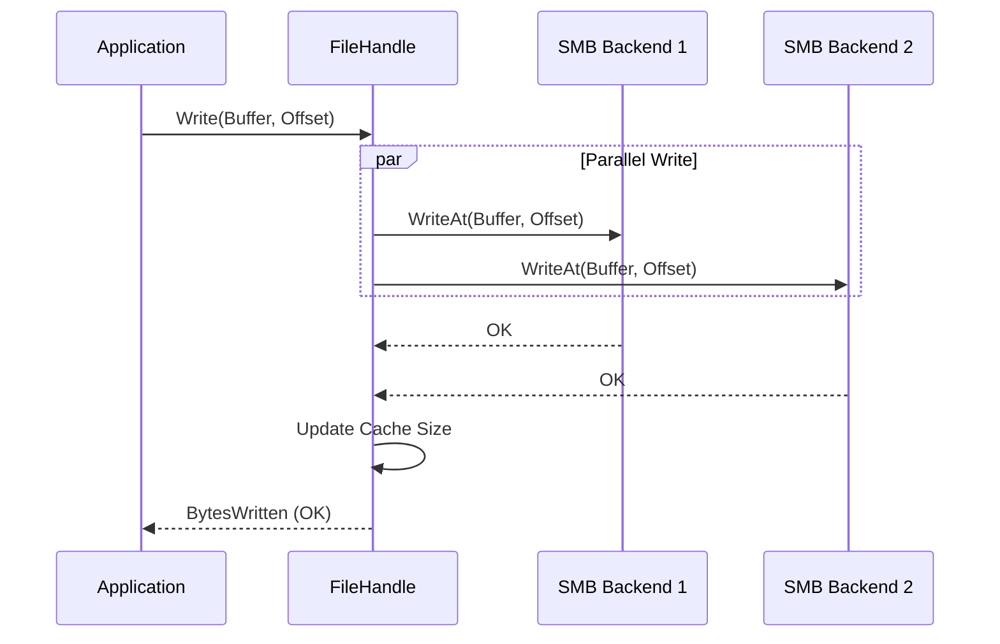

# Write Flow (Replication)

The write flow in RepliStore ensures that data is replicated across multiple backends for redundancy.

## Process Overview

### 1. File Creation
When a new file is created:
1.  **Backend Selection:** The `vfs.BackendSelector` chooses $RF$ (Replication Factor) healthy backends.
2.  **Parallel Create:** RepliStore issues `OpenFile(O_CREATE|O_RDWR)` to all selected backends in parallel.
3.  **Metadata Update:** On success, the new file and its location map are added to the metadata cache.

### 2. Writing Data
When an application writes to an open file:
1.  **Fan-out:** The incoming data buffer is sent to ALL open backend handles in parallel.
2.  **Quorum Check:** RepliStore waits for all writes to complete and counts the successes.
3.  **Quorum-Based Consistency:**
    - If the number of successful writes meets the `write_quorum`, the operation returns success to the application.
    - If a write fails on a specific backend, that backend is removed from the `FileHandle` and the file's metadata cache to avoid further I/O to that replica.
    - If the number of successful writes is less than `write_quorum`, the operation fails and returns an error.
4.  **Cache Update:** On success, the file size and the backend list in the metadata cache are updated.

## Handling Partial Failures
If a write fails on Backend A but succeeds on Backend B:
- If Backend B's success meets the `write_quorum`, the `Write` call returns success.
- Backend A is removed from the file's replica list in the metadata cache.
- The file is now considered "Degraded" but available for reads from healthy replicas.
- The **Background Repair Manager** will eventually detect this degraded state and restore the missing replica to another available backend.
