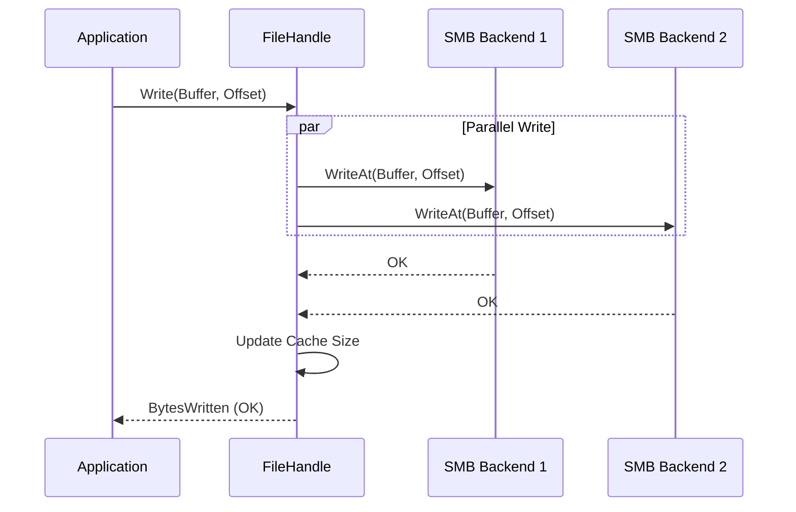

# Write Flow (Replication)

The write flow in RepliStore ensures that data is replicated across multiple backends for redundancy.

## Process Overview

### 1. File Creation
When a new file is created:
1.  **Backend Selection:** The `vfs.BackendSelector` chooses $RF$ (Replication Factor) healthy backends.
2.  **Parallel Create:** RepliStore issues `OpenFile(O_CREATE|O_RDWR)` to all selected backends in parallel.
3.  **Metadata Update:** On success, the new file and its location map are added to the metadata cache.

### 2. Writing Data
When an application writes to an open file:
1.  **Fan-out:** The incoming data buffer is sent to ALL open backend handles in parallel.
2.  **Synchronization:** RepliStore waits for all writes to complete using an `errgroup`.
3.  **Strict Consistency:**
    - If **any** write fails, the whole operation returns an error to the application.
    - This ensures that the application is aware that one or more replicas may be out of sync.
4.  **Cache Update:** On success, the file size in the metadata cache is updated.

## Handling Partial Failures
If a write fails on Backend A but succeeds on Backend B:
- The `Write` call returns an error.
- The metadata cache remains consistent with the largest successfully written offset.
- Future reads will attempt to fetch data from any healthy replica.
- *Note: A background "repair" or "scrub" task is a planned improvement to handle these divergent replicas.*
