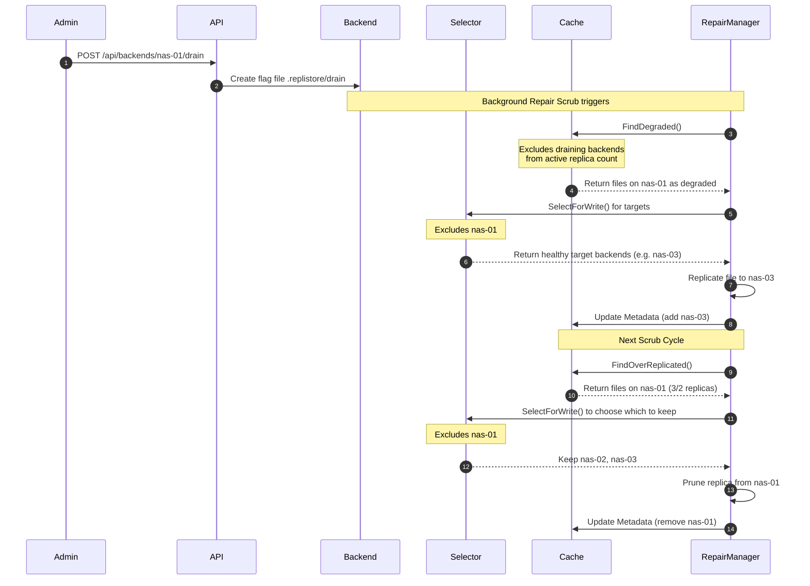

# Proposal: Backend Drain and Rebalance

This proposal details the architectural design for introducing backend **Drain** and **Rebalance** features in RepliStore.

---

## 1. Motivation

As a FUSE-based replicated filesystem, RepliStore distributes file replicas across multiple SMB and local directory backends. Currently, there is no native way to decommission a backend or redistribute existing files when backends are added or utilization becomes unbalanced.

To support cluster scaling and maintenance, we propose two key operations:
1. **Drain**: Gracefully migrate all file replicas off a specific backend and prevent any *new* allocations/writes on it. Existing replicas on the draining backend remain accessible for reads and can be modified by in-flight writes to maintain consistency until they are fully migrated and deleted.
2. **Rebalance**: Re-distribute existing replicas across all healthy backends to optimize space utilization, particularly when a new backend is added or space utilization skew exceeds a threshold.

---

## 2. Drain State Signaling

To avoid requiring restarts or complex configuration synchronizations across multiple cluster nodes, the drain intent is signaled dynamically using a flag file located on the backend itself.

### 2.1. Flag File Mechanism

- A backend is considered **draining** if a special file named `.replistore/drain` exists on its storage.
- Since `.replistore` is a reserved cluster directory replicated across backends, placing this file on a specific backend localizes the drain instruction to that storage node.
- The `HealthMonitor` ([internal/backend/monitor.go](../../internal/backend/monitor.go)) periodically performs a `Stat` check for `.replistore/drain` on all connected backends:
  ```go
  // Check for the drain flag file during routine health check
  _, err := b.Stat(ctx, ".replistore/drain")
  isDraining := err == nil
  ```
- Because all RepliStore instances mounting the same backend periodically ping and query its health, they will automatically detect the `.replistore/drain` file within one check interval. This yields decentralized, configuration-free synchronization across the entire cluster.

### 2.2. API Schema

For administrative control, we introduce endpoints in [internal/api/server.go](../../internal/api/server.go) to create or remove the flag file:

#### 1. Drain/Undrain a Backend
- **Endpoint**: `POST /api/backends/{name}/drain`
  - *Behavior*: Creates an empty `.replistore/drain` file on the named backend.
- **Endpoint**: `POST /api/backends/{name}/undrain`
  - *Behavior*: Deletes the `.replistore/drain` file from the named backend.
- **Response**:
  ```json
  {
    "name": "nas-01",
    "draining": true,
    "status": "success"
  }
  ```

#### 2. Trigger Storage Rebalance
- **Endpoint**: `POST /api/repair/rebalance`
- **Payload** (Optional parameters):
  ```json
  {
    "threshold_percent": 10,
    "max_migration_bytes": 53687091200
  }
  ```
- **Response**:
  ```json
  {
    "status": "started",
    "job_id": "rebalance-20260623-1502"
  }
  ```

#### 3. Backends Status
`GET /api/backends` retrieves the dynamic draining status populated by the health monitor:
```json
[
  {
    "name": "nas-01",
    "healthy": true,
    "draining": true,
    "free_space_bytes": 1099511627776
  }
]
```

---

## 3. Core Implementation: Drain Flow

Draining leverages the existing VFS cache and `RepairManager` mechanisms to minimize code footprint and risk.



### 3.1. Selection Filtering

To isolate the draining backend, we update [internal/vfs/selector.go](../../internal/vfs/selector.go):

1. **Write Operations**: When calling `Selector.SelectForWrite(count, allBackends)`, all draining backends are automatically removed from the `allBackends` list *before* evaluation. This ensures:
   - File creation selects healthy, non-draining backends.
   - Inline healing never writes new replicas to the draining backend.
   - Pruning algorithms naturally choose to keep non-draining backends.
2. **Read Operations**: In `Selector.SelectForRead(meta)`, if multiple healthy replicas exist, non-draining backends are always preferred. A draining backend is only read from if it contains the sole reachable replica of the file.

### 3.2. Cache Degradation View

In [internal/vfs/cache.go](../../internal/vfs/cache.go), we update the metadata calculations:

- **Degraded Status**: When `FindDegraded(rf, ...)` counts the replicas of a file, any replica residing on a draining backend is excluded from the active count:
  $$\text{ActiveCount} = \sum_{b \in \text{Backends}} [b \notin \text{Draining}]$$
  If $\text{ActiveCount} < RF$, the file is marked degraded.
- **Over-Replicated Status**: A file is marked over-replicated (ready for pruning) if:
  $$\text{len}(\text{TotalReplicas}) > RF \quad \text{and} \quad \text{ActiveCount} \ge \min(RF, \text{TotalActiveBackendsInCluster})$$
  This safety constraint guarantees we never delete the replica from the draining backend until a replacement replica has successfully converged on a healthy active backend.

### 3.3. In-flight Writes

If a client performs a write to an existing file that still resides on a draining backend, the write session (`File.Open` with write flags) uses the current `backends := f.node.Meta.Backends` list. Because the draining backend is still in this list, the write will modify the file on the draining backend. This keeps all replicas consistent until the background repair process copies the data to a new backend and prunes the draining one.

---

## 4. Core Implementation: Rebalance Flow

Rebalancing optimizes data distribution across healthy backends (e.g. when a new backend is added).

### 4.1. Planning Phase

When a rebalance is triggered, a planning routine runs:

1. **Calculate Utilization**: Gather capacity and free space from all healthy backends.
2. **Compute Average**: Calculate the average utilization:
   $$\text{AvgUtil} = \frac{\sum \text{UsedSpace}_i}{\sum \text{Capacity}_i}$$
3. **Identify Sources and Targets**:
   - **Source Backends** (over-utilized): $\text{Util}_i > \text{AvgUtil} + \text{Threshold}$
   - **Target Backends** (under-utilized): $\text{Util}_i < \text{AvgUtil} - \text{Threshold}$
4. **Scan Cache**: The VFS cache is scanned to identify files that:
   - Reside on one or more Source Backends.
   - Do *not* reside on all Target Backends.

### 4.2. Migration Phase

For each candidate file selected during the planning phase:
1. **Acquire Path Locks**:
   - Acquire the local path lock: `pathLocks.lock(path)`.
   - Acquire the distributed lock: `acquireLock(ctx, path)`.
2. **Replicate to Target**: Copy the file from an existing healthy backend to the target backend (reusing `repairNode`'s I/O flow in [internal/fuse/repair.go](../../internal/fuse/repair.go)).
3. **Evict from Source**: Remove the replica from the source backend and update metadata.
4. **Release Locks**: Release the distributed and local path locks.
5. **Throttling**: Track total bytes migrated; pause or terminate the rebalance once the configured `max_migration_bytes` limit is reached to protect network performance.

---

## 5. Security & Locking

Both operations must maintain strict POSIX correctness:
- **Write Safety**: Lock ordering must always follow the project invariant: local path lock is acquired before the distributed cluster lock.
- **Interruption Resilience**: If a node crashes mid-migration, the file metadata will temporarily show $RF + 1$ replicas. The next standard background scrub will detect this over-replication and safely prune the extra replica, maintaining data integrity.
- **Client Read Consistency**: Read requests during a drain or rebalance will transparently failover to healthy replicas, hiding data movement from FUSE client applications.
