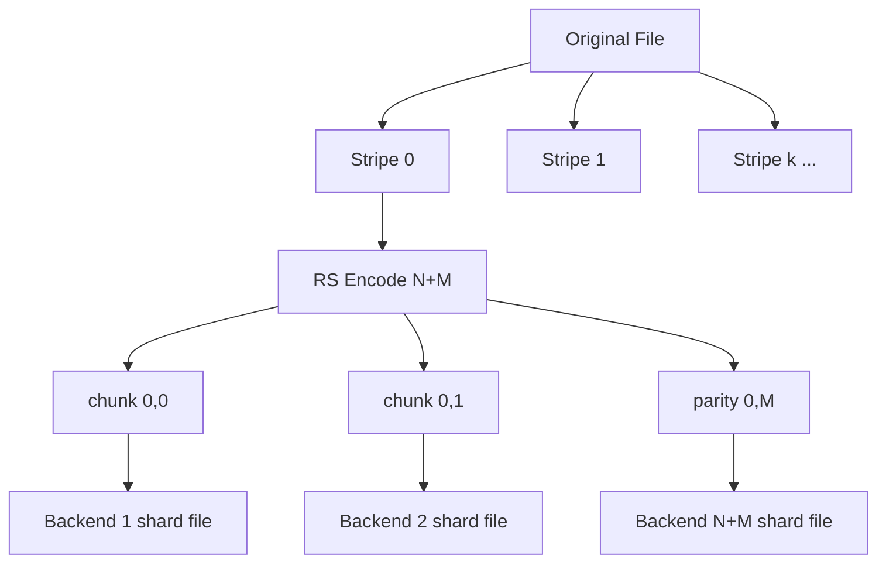

# Proposal: Erasure Coding in RepliStore

This proposal outlines the design for integrating Reed-Solomon Erasure Coding (EC) into RepliStore.

RepliStore currently uses whole-file replication. While simple, a replication factor of $3$ ($RF=3$) imposes a $200\%$ storage overhead. Implementing Erasure Coding (e.g., RS $4+2$) allows the system to tolerate the same number of backend failures ($2$) while reducing the storage overhead to $50\%$.

---

## 1. Core Design Concept

We will use systematic Reed-Solomon coding (via the `github.com/klauspost/reedsolomon` library) over a **striped layout**.

- A file is split into fixed-size **stripes** of `stripe_size` bytes.
- Each stripe is independently encoded into $N$ data chunks and $M$ parity chunks, where the chunk size is $\text{chunk\_size} = \text{stripe\_size} / N$.
- The total number of backends configured must be at least $N+M$.
- Each configured backend stores exactly one **shard** of the file. A shard is the concatenation of that backend's chunk from every stripe (see §1.1).
- Small files (e.g., $< ec\_stripe\_size$) automatically fall back to standard replication (to avoid $N+M$ small-file metadata overhead and latency). Thus, the mount supports both replicated and EC files concurrently.

The striped layout is what makes partial and random writes affordable: a write only re-encodes the **stripes it dirties**, not the whole file, saving substantial CPU. While the commit protocol writes the entire shard file via temporary copy-on-write to avoid write holes (torn writes), we still avoid full-object re-encoding overhead.



### 1.1. Shard Naming and Layout on Backends

- **Same-Name Layout:** The shard file on backend $i$ is stored at the exact original relative path (e.g., `path/to/file.ext`).
- **Shard File Structure:** Each shard file is a fixed 1024-byte header (§4) followed by that backend's chunks concatenated in stripe order, and terminates with a metadata footer containing the chunk hashes (to avoid sidecar bloat):
  ```
  [ 1024-byte header ] [ chunk(stripe 0) ] ... [ chunk(stripe k) ] [ chunk hashes footer ]
  ```
  Every chunk is exactly `chunk_size` bytes (the final stripe is zero-padded before encoding; `logical_size` recovers the true length). The byte offset of stripe $s$'s chunk inside the shard file is therefore $1024 + s \times \text{chunk\_size}$.
- **Stable Shard Mapping:** The `Sidecar` metadata document records an ordered list of backend names in its `Shards` field. The index in this list corresponds to the shard index (from $0$ to $N+M-1$), so the read and repair paths can locate the exact backend holding each shard index (backend lists can be shuffled or changed by backend selectors).
- **Unified Cache Identification:** When the VFS cache walks the backends, it identifies that `path/to/file.ext` is present on $N+M$ backends. To prevent querying the sidecar for every file on every sync, the cache sync reconciles using the cached entry if the size/mtime matches. If a file is newly discovered or changed, the cache reads the **Sidecar** to resolve the storage mode, logical size, stripe geometry, and EC parameters.

---

## 2. Configuration Options & Validation

We introduce new configuration parameters in `config.yaml`:

```yaml
# The default replication factor for replicated files (and small files fallback)
replication_factor: 2

# Storage mode: "replicated" (default) or "erasure_coded"
storage_mode: "erasure_coded"

# Erasure Coding parameters (ignored if storage_mode is "replicated")
ec_data_shards: 4
ec_parity_shards: 2

# Stripe size in bytes. Must be a multiple of ec_data_shards.
# This is fixed per file at creation time and recorded in the sidecar/header.
ec_stripe_size: 1048576

# Min shards that must commit for an EC write to succeed (>= ec_data_shards)
write_quorum: 5

# Path for the local staging/write-back cache (required for EC writes)
staging_dir: "/tmp/replistore/staging"

# Threshold size in bytes below which files use replication instead of EC (must be >= ec_stripe_size)
ec_min_file_size: 1048576
```

### Configuration Validation Rules:
- If `storage_mode` is `"erasure_coded"`:
  - Both `ec_data_shards` and `ec_parity_shards` must be $> 0$.
  - The number of configured `backends` must be $\ge ec\_data\_shards + ec\_parity\_shards$.
  - `ec_stripe_size` must be $> 0$ and an exact multiple of `ec_data_shards` (so `chunk_size` is integral).
  - `staging_dir` must be set, and the local directory must be accessible/writable.
  - `ec_min_file_size` must be $\ge ec\_stripe\_size$ to prevent excessive padding overhead on small files (e.g., a file just above the threshold must not pad to a massive stripe size).
  - The `write_quorum` setting must satisfy `write_quorum >= ec_data_shards` and `write_quorum <= ec_data_shards + ec_parity_shards`. To guarantee redundancy at commit time (e.g., at least 1 parity shard is written synchronously), we recommend configuring `write_quorum` $\ge ec\_data\_shards + 1$.

---

## 3. Metadata (Sidecar) Schema Upgrades

The per-path `Sidecar` document (under `.replistore/meta/...`) is updated to store EC properties, the stripe geometry, per-stripe integrity hashes, and the consistency markers used by the heal path.

```go
type StorageMode string

const (
	ModeReplicated   StorageMode = "replicated"
	ModeErasureCoded StorageMode = "erasure_coded"
)

// ShardInfo maps a shard index to its backend. Per-stripe chunk hashes are
// stored in the shard file footers to prevent sidecar JSON document bloat.
type ShardInfo struct {
	Backend string `json:"backend"` // backend holding this shard index
}

// ECInfo groups erasure coding properties, geometry, and verification leaves
type ECInfo struct {
	LogicalSize  int64       `json:"logical_size"`            // True logical file size
	DataShards   int         `json:"data_shards"`             // N data shards
	ParityShards int         `json:"parity_shards"`           // M parity shards
	StripeSize   int64       `json:"stripe_size"`             // Stripe size in bytes
	StripeHashes []string    `json:"stripe_hashes,omitempty"` // Merkle leaves (hashes of each original content stripe)
	Shards       []ShardInfo `json:"shards"`                  // Shard index to backend name mapping
}

type Sidecar struct {
	V           int         `json:"v"`            // Schema version (e.g., 2)
	Path        string      `json:"path"`         // Data path this document describes
	StorageMode StorageMode `json:"storage_mode"` // "replicated" or "erasure_coded"
	Writer      string      `json:"writer"`       // Node ID of the last writer
	Deleted     bool        `json:"deleted"`      // Tombstone marker for deletes

	// Version vectors (GlusterFS-style)
	DataGen     int64       `json:"data_gen"`        // Incremented on content changes (reads/writes/truncates)
	MetaGen     int64       `json:"meta_gen"`        // Incremented on metadata-only changes (chmod, rename)
	Dirty       bool        `json:"dirty,omitempty"` // Write-intent lock marker for crash recovery

	// Content verification
	FileHash    string      `json:"file_hash,omitempty"` // Content checksum: "sha256:<hex>" (replicated) or "merkle:<hex>" (erasure coded)

	// Erasure Coding Extensions (nil if StorageMode is ModeReplicated)
	EC          *ECInfo     `json:"ec,omitempty"`
}
```

We replace the single `gen` field entirely with the `DataGen` / `MetaGen` pair since we are not in production and do not require legacy migration compatibility.

---

## 4. CBOR Shard Header for Emergency Recovery

To ensure emergency recovery is possible even if VFS metadata (`.replistore/meta`) is completely lost or corrupt, each shard file prepends a **fixed-size 1024-byte header** before the raw Reed-Solomon payload.

The header carries only **file-level invariants** — the values needed to instantiate the decoder and verify the shard as a whole. Per-stripe chunk hashes do **not** fit in the header, and they do not live in the sidecar either (to avoid sidecar size bloat). Instead, they are appended to the end of the shard file payload as a footer, and the header carries a single `shard_merkle_root` covering the footer hashes to allow end-to-end integrity checks without the sidecar.

The header layout contains:
1. **Magic Header:** An 8-byte ASCII string `RST_EC01` at offset 0.
2. **CBOR Payload Length:** A 4-byte big-endian uint32 at offset 8 specifying the exact size of the CBOR bytes.
3. **CBOR Payload:** Binary CBOR metadata starting at offset 12.
4. **Null Padding:** CBOR payload is padded with null bytes (`\x00`) up to byte 992.
5. **Header Checksum:** A 32-byte SHA-256 checksum at offset 992, covering all preceding 992 bytes (magic, length, CBOR payload, and padding).

### Header Binary Layout:

```
 0                   1                   2                   3
 0 1 2 3 4 5 6 7 8 9 0 1 2 3 4 5 6 7 8 9 0 1 2 3 4 5 6 7 8 9 0 1
+-+-+-+-+-+-+-+-+-+-+-+-+-+-+-+-+-+-+-+-+-+-+-+-+-+-+-+-+-+-+-+-+
|                 Magic Header: "RST_EC01"                      |
|                      (8 bytes, ASCII)                         |
+-+-+-+-+-+-+-+-+-+-+-+-+-+-+-+-+-+-+-+-+-+-+-+-+-+-+-+-+-+-+-+-+
|             CBOR Payload Length (4-byte uint32)               |
+-+-+-+-+-+-+-+-+-+-+-+-+-+-+-+-+-+-+-+-+-+-+-+-+-+-+-+-+-+-+-+-+
|  CBOR Payload Bytes...                                        |
|  (Variable size, starting at offset 12)                       |
.                                                               .
+-+-+-+-+-+-+-+-+-+-+-+-+-+-+-+-+-+-+-+-+-+-+-+-+-+-+-+-+-+-+-+-+
|  Null Padding (\x00)                                          |
|  (Padded to exactly 992 bytes total)                          |
+-+-+-+-+-+-+-+-+-+-+-+-+-+-+-+-+-+-+-+-+-+-+-+-+-+-+-+-+-+-+-+-+
|                  SHA-256 Checksum (32 bytes)                  |
|                (of bytes [0 : 992])                           |
.                                                               .
+-+-+-+-+-+-+-+-+-+-+-+-+-+-+-+-+-+-+-+-+-+-+-+-+-+-+-+-+-+-+-+-+
|  Shard Payload (chunks, raw RS data, starts at offset 1024)   |
.                                                               .
+-+-+-+-+-+-+-+-+-+-+-+-+-+-+-+-+-+-+-+-+-+-+-+-+-+-+-+-+-+-+-+-+
```

### 4.1. Verification Workflow:
1. Read the first 1024 bytes of a shard file.
2. Check the first 8 bytes for the magic string `RST_EC01`. If absent, this is not an EC-coded file; stop here and read as a standard file.
3. Extract the `SHA-256 Checksum` ($C_{header}$) from the last 32 bytes (`header[992:1024]`).
4. Compute the SHA-256 checksum over the first 992 bytes of the header (`header[0:992]`).
5. If the calculated checksum does not match $C_{header}$, reject the file as corrupted.
6. Read the CBOR payload length from `header[8:12]`. Pass exactly that many bytes from `header[12:12+length]` to the CBOR decoder to prevent parser-dependent issues with trailing null padding.

### 4.2. CBOR Metadata Schema:
To minimize payload size and parsing overhead, CBOR map serialization uses integer keys instead of string names. 

**Go Struct Definition:**
```go
// ShardHeaderMetadata represents the fields serialized as CBOR inside the shard header.
type ShardHeaderMetadata struct {
	DataGen         int64  `cbor:"1,key"` // Authoritative DataGen
	ShardIndex      int    `cbor:"2,key"` // Shard index 0..N+M-1
	DataShards      int    `cbor:"3,key"` // N data shards
	ParityShards    int    `cbor:"4,key"` // M parity shards
	StripeSize      int64  `cbor:"5,key"` // Stripe size in bytes
	LogicalSize     int64  `json:"logical_size"` // Logical size of the file
	FileHash        []byte `cbor:"7,key"` // 32-byte raw Merkle root of original file content (consistent with Sidecar.FileHash)
	ShardMerkleRoot []byte `cbor:"8,key"` // 32-byte SHA-256 Merkle root of this shard's chunk hashes
}
```

**CDDL Schema Specification:**
```cddl
ShardHeaderMetadata = {
  1 => int,             ; data_gen (Authoritative DataGen)
  2 => uint,            ; shard_index (0..N+M-1)
  3 => uint,            ; data_shards (N)
  4 => uint,            ; parity_shards (M)
  5 => uint,            ; stripe_size in bytes
  6 => uint,            ; logical_size in bytes
  7 => bstr,            ; file_hash (32-byte raw Merkle root of original file content)
  8 => bstr,            ; shard_merkle_root (32-byte raw Merkle root)
}
```

---

## 5. Fields & Metadata Redundancy Analysis

Metadata is split between the VFS `Sidecar` (in `.replistore/meta`) and the shard `Header` because they serve different operational roles:
- **VFS Sidecar (Read/Walk Optimized):** Serves directory listings (`ReadDir`) and file properties (`Stat`) from memory without network round-trips to the backends. It is also the authoritative store for consistency markers (`DataGen`, `MetaGen`, `Dirty`).
- **Shard Header (Write/Recovery Optimized):** Rewritten only when a file's stripe set or generation changes. If the VFS cache and `.replistore/meta` indices are completely destroyed, a recovery utility can rebuild the namespace by scanning raw shard files and decoding their headers.

Note: If the sidecar metadata is lost entirely, the VFS cache falls back to scanning backend files directly. In that case `Stat` reports the raw shard file size on the backends (`header + numStripes × chunk_size + footer_size`) rather than the original logical size, until the sidecar index is rebuilt by a recovery utility.

The `path` field is omitted from the shard header because shards are stored at the original relative paths on the backends. Keeping `path` out of the header removes rename-amplification overhead.

For emergency offline recovery and integrity verification, the CBOR payload carries these **file-level** fields:
1. `data_gen`: The `DataGen` at the time the header was written. Lets recovery group only matching generations and lets the heal path identify stale shards (a shard whose header `data_gen` is below the committed `DataGen` is stale).
2. `shard_index`: Directs the Reed-Solomon decoder where to insert the shard in the input vector.
3. `data_shards` ($N$): Instantiates the decoder (e.g. `reedsolomon.New(N, M)`).
4. `parity_shards` ($M$): Instantiates the decoder.
5. `stripe_size`: The fixed stripe geometry; with $N$ it yields `chunk_size` and lets recovery locate each stripe's chunk inside the shard file.
6. `logical_size`: Truncates the systematic RS output to the exact file size (RS padding enlarges the final stripe to a multiple of `chunk_size`).
7. `file_hash`: SHA-256 **merkle root** over the per-stripe hashes of the original content. Uniquely identifies the file version and allows final verification of the fully reconstructed file.
8. `shard_merkle_root`: SHA-256 merkle root over this shard's per-stripe chunk hashes. Allows early, decoder-free corruption detection for the whole shard and lets emergency recovery verify a shard when the sidecar is gone.

Per-stripe original-content hashes are stored in the sidecar (`Sidecar.EC.StripeHashes`). Because there is only one original-content hash per stripe (unlike per-backend shard chunk hashes), this list is small ($\approx 320\text{KB}$ of raw hashes for a 10GB file at 1MB stripe size). To avoid memory bloat when loading the sidecar into the in-memory walk cache (where JSON string arrays can expand to over 1MB of heap overhead), implementations should serialize these leaves as a single packed binary blob (e.g., base64 or raw bytes) inside the sidecar. This list allows incremental Merkle root updates for `file_hash` on partial writes without reading the untouched stripes from the backends.

Per-stripe chunk hashes themselves are stored only in the **Shard Footer** to avoid bloating the sidecar JSON. This allows **targeted** scrub and heal of an individual stripe (by parsing the footer of the shard file) without reading the entire payload.

Offline recovery calculates the logical payload size of a shard as: `shard_payload_size = numStripes * chunk_size`. The total file size on disk includes the 1024-byte header and the footer. The footer size is derived as `footer_size = numStripes * 32` bytes (where 32 bytes is the size of the SHA-256 hash per stripe chunk). Thus, offline recovery can locate the start of the footer at offset `1024 + numStripes * chunk_size`.

---

## 6. Read Path Implementation

By utilizing a systematic RS code, we optimize the read path. For a logical read at offset $\text{off}$:

```
stripe   = off / stripe_size
chunkIdx = (off % stripe_size) / chunk_size        # which data shard (0..N-1)
fileOff  = 1024 + stripe * chunk_size + (off % chunk_size)
```

1. **Local Read-After-Write Consistency:**
   - If a local write staging handle exists for the path, redirect the read to read directly from the local staging file to preserve POSIX compliance.
2. **Fast-Path (No Failures):**
   - If the bytes requested fall within data shard `chunkIdx` and the backend holding that shard index (per `Shards`) is healthy:
   - Confirm that the shard's header `data_gen` (read and cached on open) matches the authoritative `Sidecar.DataGen`. If they do not match, the shard is stale (e.g., it missed the last write due to `write_quorum < N+M`); treat this backend index as missing and fall back to the **Slow-Path**.
   - Perform a direct `ReadAt` from that backend at `fileOff`. Verify the chunk against its hash retrieved from the cached footer. (To avoid paying an extra backend read roundtrip to fetch the footer on every logical read, the VFS `FileHandle` reads and caches the shard footers and headers from the backends upon file open.)
   - **No decoding/parity overhead is incurred.**
3. **Slow-Path (Degraded / Failover):**
   - If a needed data backend is down or returns corrupted data (chunk hash mismatch against the footer's hashes):
   - Read any $N$ healthy chunks **for that stripe** (data or parity) from the surviving backends.
   - Run the RS decoder to reconstruct the missing data chunk.
   - Return the reconstructed bytes to the user. Reconstruction is scoped to the affected stripe only.
4. **Boundary-Spanning Reads:**
   - A read crossing a chunk or stripe boundary is split into per-stripe sub-reads. Each sub-read takes the Fast-Path or Slow-Path independently, and the results are merged before returning to the FUSE kernel.

Note on Overhead: For files near the `ec_min_file_size` threshold (which is $\ge ec\_stripe\_size$, e.g. 1MB) spread across $N+M=6$ shards, the 1024-byte header and shard footers add $\sim 0.1\%$ overhead per shard. This overhead scales down quickly for larger files and justifies setting `ec_min_file_size` sufficiently high.

---

## 7. Write Path & Staging Area

We implement a local write-back cache as a staging area, with **dirty-stripe tracking** so that a flush only re-encodes the stripes that actually changed. To eliminate the classic EC "write hole" (torn writes causing permanent data loss on crash), we write updated shard chunks to temporary files and atomically rename them upon quorum validation.

1. **Storage Mode Selection at First Flush:**
   - The storage mode is determined during the file's first `Flush`/`Close` (before any backend data is written): if the size is $< ec\_min\_file\_size$, the VFS commits it using standard replication (to `replication_factor` backends). If the size is $\ge ec\_min\_file\_size$, it commits it as an erasure-coded file (to $N+M$ backends).
   - Once the file is committed to the backends for the first time, its storage mode is locked and cannot be changed dynamically. Empty files (0 bytes) created but never written remain as candidates for the default mode until their first flush.
2. **Open for Write:**
   - Create a local working file in `staging_dir` and a dirty-stripe bitmap.
   - For an **existing** EC file, stripes are faulted into staging on demand: a write that does not cover a full stripe first reads that stripe (Fast-Path, or Slow-Path if degraded) so the read-modify-write has the surviving data needed to recompute parity.
3. **Writes:**
   - Each write lands in the staging file and marks the covering stripes dirty.
4. **Flush / Release (Commit Protocol):**
   - If the file was committed in replicated mode (e.g. legacy files, or small files configured to run as replicated): use standard replication (write the whole file to `replication_factor` backends) and skip the EC path.
   - Otherwise, run the EC commit protocol:
     1. **Lock** the path (existing VFS path lock / fencing).
     2. **Set intent:** write the sidecar with `Dirty = true` and `DataGen` incremented. This intent record is the recovery anchor — any crash after this point is detectable.
     3. **Encode dirty stripes:** for each dirty stripe, RS-encode its $N+M$ chunks.
     4. **Write to temporary shards via Copy-on-Write:** For each backend, copy the existing shard to a temporary file (`path.tmp.shard_index`), patch the dirty stripes with their new chunks, and verify its integrity. Writing the full shard via temp files prevents overwriting the old generation in place (eliminating the EC write hole), though we still save CPU overhead by only re-encoding dirty stripes.
        - *Copy-Offload Optimization:* Since copying the entire shard file over the network can incur high I/O latency, the VFS should offload the copy server-side where the backend supports it (e.g., using SMB `FSCTL_SRV_COPYCHUNK` or copy-offload commands). If copy offloading is unsupported by the backend, this I/O amplification must be documented, and EC should be recommended primarily for append-heavy or large sequential workloads rather than frequent small random rewrites.
     5. **Re-hash and build Footers:** recompute the SHA-256 chunk hash for every dirty chunk, recompute each touched shard's `shard_merkle_root` and the file-level `file_hash` (using `Sidecar.EC.StripeHashes` to incrementally update Merkle roots). Append the new chunk hashes footer to the temporary shard files.
     6. **Verify write quorum:** the session succeeds only if, for every dirty stripe, at least `write_quorum` chunks were written successfully to the temporary files. If not, leave `Dirty = true` and fail; the client may retry. Note: If `write_quorum` is less than $N+M$ (e.g., 5 of 6), a successful write session will leave some shards stale. This is expected; the VFS cache identifies these via generation checks, and the background `RepairManager` (§8) heals them asynchronously.
     7. **Update Header in Temp and Atomic Commit (Rename):** Update and write the new 1024-byte header block (containing the new `data_gen` and checksums) directly into the temporary shard files `path.tmp.shard_index`. Then, atomically rename the temporary shard files to their final names `path` on the backends. This ensures that the new payload and the new header generation are committed in a single atomic step.
     8. **Clear intent:** write the sidecar with `Dirty = false`, the final `file_hash`, updated `Sidecar.EC.StripeHashes`, and the committed `DataGen`. This sidecar write is the transaction commit point.
     9. **Unlock.**
   - Delete the local staging file and acknowledge completion of the write/close to the kernel.
5. **Truncates and Shrinks:**
   - A file truncate or shrink operation is treated as a content write: it increments `DataGen`, runs through the same staging and commit protocol, and recomputes the stripe count, header `logical_size`, and footer offsets for the newly reduced file geometry.

Crash semantics:
- A crash during writing leaves the sidecar with `Dirty = true`. Because we write to temporary files, the old generation remains intact on the final paths.
- **Partial Rename Resolution:** Since renames across $N+M$ backends are non-atomic, a crash during Step 7 can leave $k$ backends renamed to `path` (at generation $G+1$) and the remainder at generation $G$ (some still having the temporary files). The `RepairManager` (§8) handles this: if a quorum of renamed/temporary files is present, it rolls the transaction forward; otherwise, it rolls back by reconstructing any overwritten generation $G+1$ shards from the surviving generation $G$ shards (since $N$ shards are sufficient to reconstruct the old generation $G$ data).
- **Degraded-Read Performance Cliff:** A failed write that aborts before commit leaves the sidecar at `DataGen = G+1` while the committed backend shard headers are still at $G$. This causes subsequent fast-path reads to mismatch on generation, dropping the entire path into slow-path decode (degraded-read cliff). To bound this performance degradation, the `RepairManager` must prioritize healing paths where `Dirty = true` immediately.

Metadata-only operations (rename, changing `Deleted`, etc.) bump `MetaGen` only, write the sidecar, and never touch shard data or trigger a data heal.

Staging cache sizing: staging buffers only the working set of dirty stripes plus any stripes faulted in for read-modify-write, not necessarily the whole file.

---

## 8. Background Repair & Heal Integration

For erasure-coded files the `RepairManager` performs both shard-loss repair and post-crash heal:

1. **Trigger detection.** A path is queued for heal if either:
   - its sidecar has `Dirty = true` (interrupted write session), or
   - a shard backend from `Shards` is missing, or
   - a scrub detects a chunk whose SHA-256 disagrees with the hash recorded in the shard's footer.
2. **Generation reconciliation (GlusterFS-style).** For each affected stripe, read the shard headers from the surviving backends and take the highest `data_gen` as authoritative. Chunks with a lower `data_gen` are treated as missing. If `Dirty = true` in the sidecar, the heal path reconciles whether a quorum of new temporary shard files exists. If yes, it rolls the transaction forward; if no, it discards the temporary files (rolling back).
3. **Reconstruct.** If at least $N$ authoritative chunks survive for a stripe, RS-decode the missing/stale chunks, recompute their chunk hashes, write them to temporary files, and rename them atomically. Refresh the affected shard headers (`shard_merkle_root`, `file_hash`) reusing the **authoritative `DataGen`**.
4. **Finalize.** Once every stripe is consistent and every shard index present, clear `Dirty` in the sidecar.

Repair never bumps `DataGen`: all $N+M$ shards of a stripe must share one generation so that generation reconciliation stays well-defined and the CBOR headers remain clean for emergency recovery.
