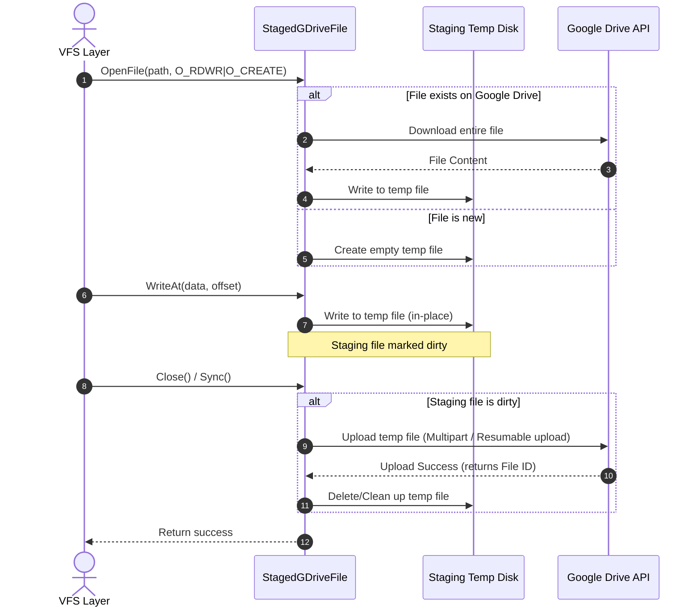

# Proposal: Google Drive Cold Storage Backend

This proposal outlines the architectural design for integrating Google Drive as a highly durable, low-cost cold storage backend for RepliStore.

---

## 1. Motivation

RepliStore replicates data across local directories and SMB shares to ensure high availability. However, local or local-network hardware can fail in catastrophes (fire, theft, power surges). We need a "safe harbor" outside our immediate domain.

Google Drive offers:
* High durability and geo-redundancy.
* Low maintenance and cost-effectiveness (including free tiers).
* Easy recovery from disaster scenarios.

However, Google Drive is an object storage service accessed over HTTPS. It presents three challenges:
1. **No random-access writes:** Google Drive requires files to be uploaded fully or in chunked sequences. It cannot modify bytes in-place.
2. **Path vs. Resource ID model:** Google Drive identifies items using unique alphanumeric IDs (e.g., `1a2b3c...`) rather than hierarchical Unix paths.
3. **API rate limits:** Google Drive limits API requests per user (typically 100 requests per 100 seconds).

To overcome these constraints, this proposal introduces a **local staging layer** for writes, **hierarchical directory caching**, and a **token-bucket rate limiter** within the backend driver.

---

## 2. Configuration Options

A new backend type `gdrive` will be added. Below is the proposed configuration snippet in [config.yaml](../../config.yaml):

```yaml
backends:
  - name: "gdrive-cold"
    type: "gdrive"
    auth:
      # Option A: Service account credentials JSON path (recommended for headless daemons)
      service_account_file: "/var/lib/replistore/gdrive_service_account.json"
      # Option B: Client credentials flow (requires initial user consent)
      # client_secrets_file: "/var/lib/replistore/client_secrets.json"
      # token_file: "/var/lib/replistore/gdrive_token.json"
    root_folder_name: "RepliStore_Cold_Root"
    staging_dir: "/var/lib/replistore/gdrive_staging"
    speed: 1                           # Low speed rating ensures reads bypass Google Drive if healthy replicas exist
    tags: ["cold-storage"]             # Used by SmartSelector for write affinity routing
    max_qps: 10                        # Rate-limit client-side requests to avoid API bans
```

---

## 3. Authentication & Directory Setup

To connect to Google Drive, the backend will implement two auth paths:

1. **Service Account Credentials:**
   * The user generates a Service Account JSON from the Google Cloud Console.
   * The Service Account automatically authenticates without interactive prompts.
2. **User OAuth2 Credentials:**
   * Uses `client_secrets.json` and a cached `gdrive_token.json`.
   * A CLI tool (e.g., `replistore auth gdrive`) will trigger the oauth consent page to retrieve the refresh token.

### Root Folder Resolution
Upon startup in `Connect`, the driver will look up the `root_folder_name` in Google Drive.
* If it exists, retrieve its ID.
* If it does not exist, create it and store its ID in memory.

---

## 4. Path-to-ID Mapping (Directory Cache)

Unix paths are hierarchical strings (e.g., `/photos/2026/summer.png`). Google Drive represents files as objects inside parent folders identified by IDs.

### Traversal and Cache
To resolve a path, we must resolve each directory segment down to its ID. A naive recursive lookup causes $O(D)$ API requests (where $D$ is directory depth).
To avoid this overhead, the `gdrive` backend will maintain an in-memory **Directory ID Cache**:

```go
type DirectoryCache struct {
	mu    sync.RWMutex
	cache map[string]string // maps folder path "/photos/2026" -> Google Drive Folder ID
}
```

* **Cache Hits:** If `/photos/2026` is in the cache, retrieve its ID instantly.
* **Cache Misses:** Traverse from the closest cached ancestor, lookup/create the missing segments via API, and store them.
* **Tombstones & Rename:** On `Remove` or `Rename`, clear corresponding paths from the cache.

---

## 5. Read and Write Path Design

The `gdrive` backend must conform to the [Backend](../../internal/backend/backend.go#L28) interface.

### 5.1. The Read Path (`ReadAt`)

Since files on Google Drive are read-only objects, we can perform partial reads using HTTP Range Requests:

1. Look up the file ID by resolving its parent directory.
2. Send an HTTP GET request to the Google Drive API (`files.get` with `alt=media`) using the `Range: bytes=start-end` header.
3. Stream the requested slice back to the client.

> [!TIP]
> This matches perfectly with the proposed chunk cache. Small reads will be cached locally, preventing Google Drive network overhead on subsequent lookups.

### 5.2. The Write Path (`WriteAt` via Local Staging)

Because Google Drive does not support in-place mutations, we use a **Local Staging File** to wrap the [File](../../internal/backend/backend.go#L21) interface.

```go
type StagedGDriveFile struct {
	backend    *GDriveBackend
	remotePath string
	tempFile   *os.File
	dirty      bool
}
```

#### Write Logic Workflow



1. **OpenFile:**
   * If the file is opened for writing (e.g. `O_WRONLY`, `O_RDWR`):
     * Create a temporary file in `staging_dir` using `os.CreateTemp`.
     * If the file already exists on Google Drive, download it fully to the temporary file first.
   * Return a `StagedGDriveFile` wrapper.
2. **WriteAt:**
   * Write data directly to the local temporary file. Set `dirty = true`.
3. **Close / Sync:**
   * If `dirty` is true:
     * Initiate a Resumable Media Upload to Google Drive.
     * Upload the staging file content.
     * Update/overwrite the remote file metadata.
     * Close and delete the local temporary file.

---

## 6. Rate Limiting and Resilience

Google Drive API limits can cause client hangs or write failures if not handled gracefully.

1. **Token-Bucket Limiter:** A client-side rate limiter limits requests to `max_qps` (default 10). Every API call must acquire a token from the bucket.
2. **Exponential Backoff:** If the API returns HTTP 403 (User Rate Limit Exceeded) or HTTP 429 (Too Many Requests), retries will run with exponential backoff and randomized jitter:
   $$T_{\text{backoff}} = 2^{\text{attempt}} + \text{rand}(0, 1000)\text{ms}$$
3. **Quorum Synergy:** Since RepliStore allows write operations to succeed with a lower `write_quorum` (e.g., $WQ=1$ on $RF=2$), Google Drive uploads can run in the background or fail without blocking the client immediately, provided the primary hot storage commits successfully.

---

## 7. Trade-offs

| Aspect | Pros | Cons |
| :--- | :--- | :--- |
| **Durability** | Safe from local site failure; highly redundant. | Dependent on internet connectivity. |
| **Staging Disk** | Prevents network latency during random writes. | Requires staging disk space equal to the size of open write files. |
| **Path Traversal** | Readable native Google Drive folder structure. | Directory cache lookup overhead on cache misses. |

---

## 8. Implementation Plan

1. **Phase 1:** Add Google Drive SDK dependency (`google.golang.org/api/drive/v3`) and implement `auth` credentials flow.
2. **Phase 2:** Implement the `Directory ID Cache` to handle path translations.
3. **Phase 3:** Write the `StagedGDriveFile` local staging logic to fulfill the [File](../../internal/backend/backend.go#L21) interface wrapper.
4. **Phase 4:** Add unit tests using standard Go HTTP test servers to mock Google Drive responses.
