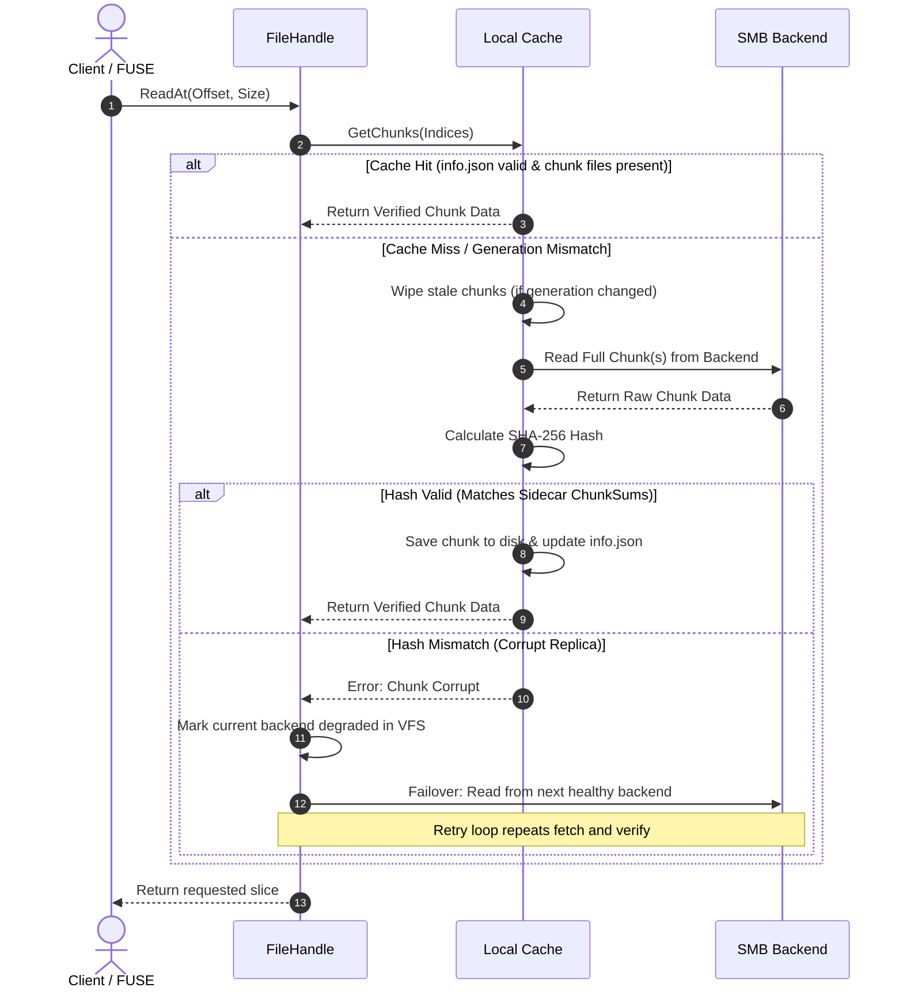

# Proposal: Read-Path Checksum Verification and Local Chunk-Based Caching

This proposal describes the architectural design for bringing end-to-end checksum verification to the read path of RepliStore, combined with a local chunk-based read-through cache to avoid prohibitive latency overheads.

---

## 1. Motivation

RepliStore maintains data consistency across multiple SMB shares by relying on versioned sidecars (generations). Today, data integrity verification is only half-implemented:
* During background sync or repair, the [RepairManager](file:///home/ksharlaimov/dev/replistore/internal/fuse/repair.go) computes a full-file SHA-256 checksum and saves it to the path's [Sidecar](file:///home/ksharlaimov/dev/replistore/internal/vfs/sidecar.go#L40) file.
* On live writes, the checksum is cleared (blanked) because random-access writes make continuous full-file hashing infeasible.
* **The Gap**: The read path ([FileHandle.Read](file:///home/ksharlaimov/dev/replistore/internal/fuse/fs.go#L1844)) performs no checksum validation whatsoever.

To detect bit rot or crash artifacts transparently, the read path must check the stored sums. However, reading an entire multi-gigabyte file from a remote SMB share to verify a small, partial FUSE read (e.g., a $128\text{ KB}$ block) would introduce **prohibitive latency**.

### The Solution
We propose a **local block-level (chunk-based) read-through cache** coupled with **chunk-level checksums**. 
* Files are divided into fixed-size chunks (e.g., $1\text{ MB}$).
* Checksums are tracked per chunk inside the version sidecar.
* The read path fetches and hashes data at chunk boundaries on cache misses, validating the chunk before caching it to local storage.
* Subsequent reads for the same chunk are served instantly from the local cache with zero network round-trips and zero CPU hashing overhead.

---

## 2. Local Cache Directory Organization

To avoid the complexity and overhead of managing an external database (e.g., SQLite or BoltDB), the local cache uses a filesystem-native directory layout. We hash the file path to generate a unique **Cache ID** that aligns directly with the existing [MetaPath](file:///home/ksharlaimov/dev/replistore/internal/vfs/sidecar.go#L69) scheme:

```
cache_root/
└── <h0>/
    └── <h1>/
        └── <hash>/                      <-- Cache ID (SHA-256 of path)
            ├── info.json                 <-- Cache metadata (Gen, Size)
            ├── 0.chunk                   <-- Chunk 0 data
            ├── 1.chunk                   <-- Chunk 1 data
            └── 2.chunk                   <-- Chunk 2 data
```

### Cache Metadata (`info.json`)
The `info.json` file binds the locally cached chunks to a specific file version and size:
```json
{
  "gen": 42,
  "size": 3145728
}
```

---

## 3. Sidecar Schema Extensions

To support block-level verification, the sidecar structure is extended to store chunk details. The schema remains backward-compatible: if `ChunkSums` is empty, the system can fallback to full-file hashing or ignore validation.

```diff
type Sidecar struct {
	V       int    `json:"v"`       // format version, 1
	Path    string `json:"path"`    // data path this document describes
	Gen     int64  `json:"gen"`     // generation counter
	Writer  string `json:"writer"`  // node that produced this generation
	Deleted bool   `json:"deleted"` // tombstone marker

	// Sum is the full-file checksum (fallback/legacy)
	Sum string `json:"sum,omitempty"`

+	// ChunkSize defines the block boundaries (e.g. 1048576 for 1MB)
+	ChunkSize int64 `json:"chunk_size,omitempty"`
+
+	// ChunkSums holds the SHA-256 hex checksum of each chunk ordered by index
+	ChunkSums []string `json:"chunk_sums,omitempty"`
}
```

---

## 4. Read Path Workflow

When FUSE issues a read request for a byte range, `FileHandle.Read` maps it to one or more chunk indices and coordinates with the cache:



---

## 5. Write Path & Invalidation Workflow

When a file is modified, the local cache must be invalidated instantly and safely to prevent serving stale data:

1. **Write Start**: When `File.Open` is called for writing, the node acquires its locks and bumps the generation.
2. **Local Cache Eviction**: The local cache directory for the file (`cache_root/<h0>/<h1>/<hash>/`) is immediately wiped:
   ```go
   os.RemoveAll(path.Join(cacheRoot, h0, h1, hash))
   ```
3. **Write Operations**: As the client writes to the backends, chunks are written directly.
4. **Closing/Fsync**:
   * The new chunk hashes are calculated for the mutated blocks.
   * The new generation sidecar is written to the backends, updating the `ChunkSums` array for modified chunks (unwritten/untouched chunks preserve their old sums, while newly written ones get their fresh hashes stamped).

---

## 6. Eviction & Resource Management (LRU)

Since there is no external metadata database, cache eviction is managed by a lightweight, file-system-native worker:

* **Frequency**: The worker runs periodically or is triggered when the disk usage of `cache_root` crosses a configured threshold (e.g., $90\%$ of allocated space).
* **Selection Policy**: The worker traverses the directory tree and inspects the modification/access times of the `info.json` files.
* **Eviction Execution**: To free space, the worker evicts the oldest entries by removing the entire directory:
  ```go
  os.RemoveAll(cacheIDPath)
  ```
  This is extremely fast and ensures atomic eviction of a file's entire cache set.

---

## 7. Configuration Options

The following fields will be added to the RepliStore configuration schema:

```yaml
cache:
  enabled: true
  dir: "/var/lib/replistore/cache"
  max_size_gb: 50
  chunk_size_mb: 1
```

---

## 8. Summary of Trade-offs

* **Pros**:
  * **Network Resilience**: Eliminates constant SMB round-trips for hot files.
  * **Granular Integrity**: Detects and fails over on corrupt blocks immediately, rather than waiting for EOF.
  * **Database-Free**: Relies entirely on directory tree structures, making it immune to KV store corruption and easy to debug.
* **Cons**:
  * **First-Read Latency**: The first read of a block fetches the entire $1\text{ MB}$ chunk, which may slightly delay the initial request on slow connections (mitigated by high-speed LAN environments).
  * **Local Disk Requirement**: Nodes must have enough local storage (SSD recommended) to house the cache.
